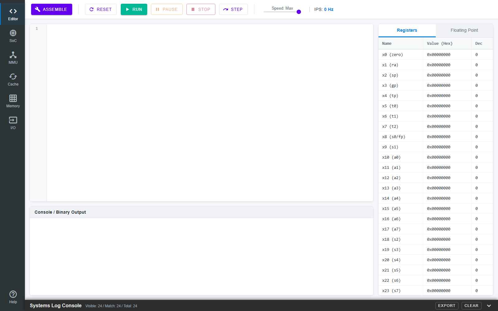

# RISC-V SoC Simulator & Assembler

[](LICENSE)
[](https://risc-v.vercel.app)
[](https://riscv.org/)

RISC-V SoC Simulator & Assembler là công cụ web hỗ trợ soạn thảo, biên dịch và mô phỏng chương trình hợp ngữ RISC-V trong một mô hình System-on-Chip đơn giản. Dự án phục vụ mục tiêu học tập, kiểm thử và minh họa cách CPU, bộ nhớ, bus, cache, DMA và các ngoại vi phối hợp trong một hệ thống nhúng.

Hiện thực bằng JavaScript thuần (ES modules), không phụ thuộc framework hay bước build; CodeMirror tải qua CDN.

## Demo

Truy cập bản triển khai trực tuyến:

https://risc-v.vercel.app

## Giao diện



Giao diện gồm trình soạn thảo assembly (CodeMirror với gợi ý cú pháp), bảng thanh ghi số nguyên và dấu phẩy động, console xuất nhị phân, cùng các tab quan sát phần cứng: **SoC**, **MMU**, **Cache**, **Memory** và **I/O**. Thanh công cụ hỗ trợ Assemble, Run, Pause, Stop, Step và điều chỉnh tốc độ mô phỏng.

## Chức năng chính

- Soạn thảo chương trình RISC-V assembly trực tiếp trên trình duyệt.
- Biên dịch assembly sang mã máy bằng assembler tích hợp.
- Mô phỏng thực thi chương trình theo từng bước hoặc chạy liên tục.
- Quan sát thanh ghi, bộ nhớ, log hệ thống và trạng thái các khối phần cứng.
- Mô phỏng các thành phần SoC gồm CPU, MMU, cache, TileLink, DMA, UART, CAN, LED matrix, keyboard và mouse.
- Hỗ trợ kiểm thử assembler với GNU RISC-V toolchain, Spike và bộ `riscv-tests`.

## Kiến trúc mô phỏng

Dự án mô hình hóa một hệ thống SoC gồm các thành phần chính:

- `CPU`: thực thi lệnh RISC-V và phát sinh yêu cầu truy cập bộ nhớ.
- `MMU`: xử lý dịch địa chỉ và kiểm tra quyền truy cập.
- `Cache`: mô phỏng tầng nhớ đệm giữa CPU và bus.
- `TileLink`: mô phỏng giao tiếp giữa các master, slave và bộ nhớ.
- `DMA`: thực hiện truyền dữ liệu độc lập với CPU.
- `Memory`: lưu trữ chương trình và dữ liệu.
- `Peripheral`: mô phỏng các thiết bị ngoại vi như UART, CAN, LED matrix, keyboard và mouse.

CAN được hiện thực như một ngoại vi giáo dục tối thiểu ở mức frame/message qua MMIO. Mô hình chỉ hỗ trợ standard ID 11-bit, DLC 0..8, payload tối đa 8 byte, một TX mailbox, một RX mailbox và loopback. Mô hình không có physical layer, bit stuffing, CRC, ACK hoặc arbitration bit-level.

Tài liệu *Bosch M_CAN Controller Area Network User's Manual*, Revision 3.3.1, được dùng làm tham khảo về cách tổ chức một CAN controller. Project không tái hiện M_CAN mà chỉ chọn tập con tối thiểu nêu trên.

## Bản đồ ngoại vi MMIO

| Thiết bị | Dải địa chỉ | Bus |
|---|---|---|
| UART | `0x10000000-0x10000013` | TileLink-UL |
| LED Matrix | `0xFF000000-0xFF000FFF` | TileLink-UL |
| Mouse | `0xFF100000-0xFF100013` | TileLink-UL |
| CAN Controller | `0xFF200000-0xFF2000FF` | TileLink-UL |
| DMA Registers | `0xFFED0000-0xFFED0007` | TileLink-UH |
| Keyboard | `0xFFFF0000-0xFFFF0007` | TileLink-UL |

## Cấu trúc thư mục

```text
.
├── src/
│   ├── index.html
│   ├── style.css
│   └── js/
│       ├── assembler.js
│       ├── cpu.js
│       ├── soc.js
│       ├── mmu.js
│       ├── SimpleCache.js
│       ├── tilelink*.js
│       ├── dma.js
│       ├── can.js
│       └── peripheral modules
├── test/
│   ├── assembler_verify.mjs
│   ├── verify_rv32imf_against_gnu.mjs
│   ├── verify_project_assembler_spike.mjs
│   ├── verify_riscv_tests_spike.mjs
│   └── sample assembly programs
├── README.md
└── LICENSE
```

## Yêu cầu hệ thống

Để chạy giao diện web:

- Trình duyệt hiện đại hỗ trợ JavaScript module.
- Kết nối Internet nếu dùng các thư viện được tải từ CDN.
- Python hoặc một static HTTP server tương đương.

Để chạy các script kiểm thử:

- Node.js.
- GNU RISC-V toolchain nếu cần đối chiếu với GNU assembler.
- Spike nếu cần kiểm thử hành vi thực thi.
- `riscv-tests` nếu cần chạy verification với bộ test chính thức.

## Chạy ứng dụng cục bộ

Từ thư mục gốc của project:

```bash
python -m http.server 8000
```

Sau đó mở:

```text
http://localhost:8000/src/
```

Nên chạy qua HTTP server thay vì mở trực tiếp file `src/index.html`, vì project sử dụng JavaScript module.

## Cách sử dụng

1. Mở giao diện simulator trên trình duyệt.
2. Nhập chương trình RISC-V assembly trong vùng editor.
3. Chọn assemble để biên dịch chương trình sang mã máy.
4. Nạp chương trình vào simulator.
5. Dùng chế độ chạy từng bước hoặc chạy liên tục để quan sát quá trình thực thi.
6. Theo dõi thanh ghi, bộ nhớ, log hệ thống và trạng thái các ngoại vi để phân tích hành vi chương trình.

## Kiểm thử

Các kiểm thử cơ bản có thể chạy trực tiếp bằng Node.js:

```bash
node test/assembler_verify.mjs
node test/mmu_basic_verify.mjs
node test/tilelink_verify.mjs
node test/can_verify.mjs
node test/can_mmio_verify.mjs
node test/asm_programs_verify.mjs
```

Các kiểm thử đối chiếu với GNU toolchain và Spike:

```bash
node test/verify_rv32imf_against_gnu.mjs
node test/verify_riscv_tests_spike.mjs
```

Các script này dùng GNU binutils để kiểm tra encoding trên artifact từ `riscv-tests` và dùng Spike làm reference model cho hành vi thực thi. Nếu Spike không nằm trong `PATH`, có thể chỉ định trực tiếp:

```bash
SPIKE=/duong/dan/toi/spike node test/verify_riscv_tests_spike.mjs
```

## Verification với riscv-tests

Thư mục `riscv-tests/` chỉ phục vụ môi trường verification cục bộ và không cần commit vào repository chính. Nếu cần chạy lại verification, clone riêng bộ test này tại thư mục gốc:

```bash
git clone https://github.com/riscv/riscv-tests.git riscv-tests
cd riscv-tests
git submodule update --init --recursive
make isa XLEN=32
```

Sau khi build, quay lại thư mục gốc của project và chạy:

```bash
node test/verify_rv32imf_against_gnu.mjs
node test/verify_riscv_tests_spike.mjs
```

Nếu `riscv-tests/` xuất hiện trong Source Control của VS Code, hãy đảm bảo thư mục này đã được đưa vào `.gitignore`:

```gitignore
riscv-tests/
```

Việc bỏ qua thư mục này giúp repository chính chỉ lưu mã nguồn của simulator, assembler và các script verification cần thiết.

## Ghi chú về line ending trên Windows

Khi commit trên Windows, Git có thể hiển thị cảnh báo dạng:

```text
LF will be replaced by CRLF the next time Git touches it
```

Đây là cảnh báo về line ending, không phải lỗi logic của project. Nếu muốn hạn chế thay đổi line ending ngoài ý muốn, có thể cấu hình Git theo nhu cầu của môi trường phát triển.

## Trích dẫn / How to cite

Nếu bạn sử dụng công cụ này trong nghiên cứu, giảng dạy hoặc đồ án, vui lòng trích dẫn:

> Nguyễn Xuân Lộc và Gia Khang, *RISC-V SoC Simulator & Assembler*, Khóa luận tốt nghiệp, Khoa Kỹ thuật Máy tính, Trường Đại học Công nghệ Thông tin (ĐHQG-HCM), 2026. https://github.com/xuanloc25/risc_v

Repository có sẵn file [`CITATION.cff`](CITATION.cff); GitHub sẽ hiển thị nút **"Cite this repository"** với định dạng APA/BibTeX.

## License

Developed by Xuan Loc and Gia Khang<br>
Faculty of Computer Engineering<br>
University of Information Technology – VNU-HCM
