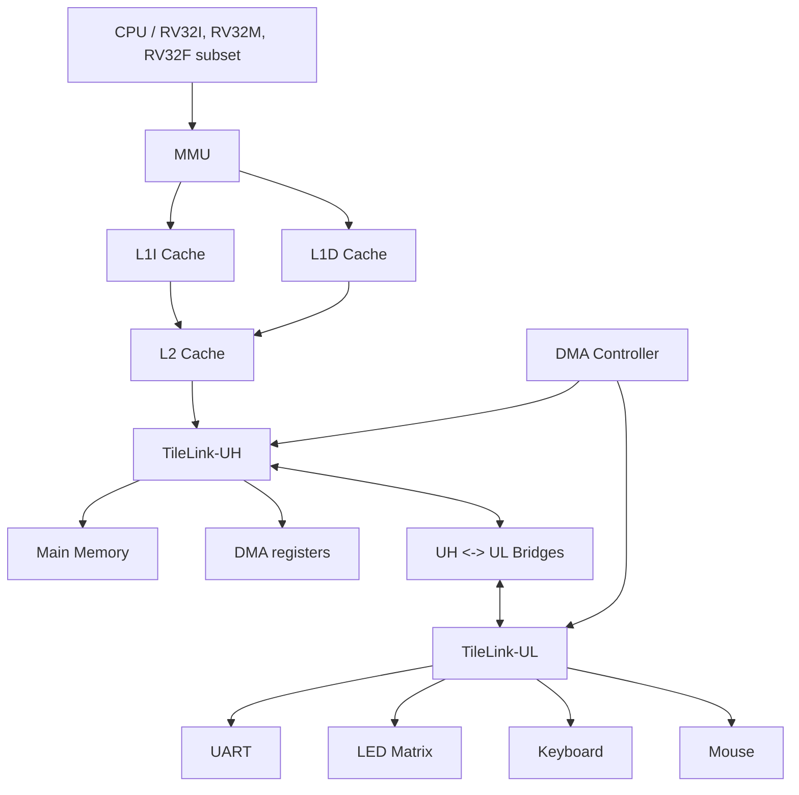

# 00. Project analysis trước khi viết báo cáo KLTN

Đề tài: **Phát triển trình mô phỏng hệ thống trên chip dựa trên kiến trúc tập lệnh RISC-V RV32IMF và giao thức TileLink**

Tên tiếng Anh: **Developing a System-on-Chip Simulator Based on RISC-V RV32IMF Instruction Set Architecture and TileLink Protocol**

Sinh viên: Nguyễn Xuân Lộc - 22520793; Dương Hiển Gia Khang - 22520610

GVHD: ThS. Nguyễn Thành Nhân; KS. Trần Đại Dương

Ngày quét source: 2026-06-02

Workspace: `D:\STUDY\UIT\DoAn1\web\assembler`

## 1. Phạm vi quét và nguyên tắc ghi nhận

Các nguồn đã kiểm tra:

- Source chính đã được Git track: `src/`, `test/`, `README.md`, `verification_plan.docx`, `.gitignore`, `LICENSE`, `screenshot.png`.
- Tài liệu tham khảo trong `docs/ref/`: đề cương đề tài PDF, TileLink spec PDF, hình SoC, phụ lục/mẫu/checklist KLTN.
- Git log gần nhất bằng `git log --oneline --decorate --all -n 50`.
- Trạng thái Git hiện tại: `docs/` đang là untracked (`?? docs/`); `riscv-tests/` tồn tại cục bộ nhưng bị ignore theo `.gitignore`.

Nguyên tắc phân tích:

- Chỉ khẳng định chức năng khi có file nguồn hoặc test/demo cụ thể.
- Nếu chức năng chỉ xuất hiện trong README/help nhưng chưa thấy trong source, ghi là cần xác nhận.
- `riscv-tests/` là checkout verification cục bộ, không xem là source chính của simulator vì `.gitignore` có `riscv-tests/` và README cũng mô tả đây là môi trường verification cục bộ.

## 2. Tổng quan hệ thống

Project là một ứng dụng Web tĩnh mô phỏng SoC RISC-V và assembler chạy trong trình duyệt. Giao diện chính nằm ở `src/index.html`, style ở `src/style.css`, logic UI ở `src/js/javascript.js`. Lõi mô phỏng SoC được lắp ghép trong `src/js/soc.js`.

Luồng kiến trúc chính từ source:

Bằng chứng chính:

- `src/js/soc.js` khai báo địa chỉ MMIO cho LED, UART, Mouse, Keyboard, DMA và khởi tạo CPU, MMU, cache, TileLink-UH, TileLink-UL, DMA, bridge, RAM, ngoại vi.
- `src/js/soc.js` nối port: CPU -> MMU, MMU -> L1I/L1D, L1I/L1D -> L2, L2 -> TileLink-UH, TileLink-UH -> RAM/DMA/bridge, TileLink-UL -> UART/LED/Keyboard/Mouse/bridge.
- `src/js/soc_diagram.js` định nghĩa node/edge cho sơ đồ SoC trực quan.
- `docs/ref/SoC.png` là hình tham khảo kiến trúc SoC có CPU, MMU, cache, TileLink-UH/UL, DMA, memory và ngoại vi.

## 3. Kiến trúc project

### 3.1. Thư mục và file cấp cao

| Khu vực | File/thư mục | Vai trò |
|---|---|---|
| Web UI | `src/index.html`, `src/style.css`, `src/js/javascript.js` | Giao diện editor, memory/register view, SoC view, MMU view, cache view, I/O view, help, system log. |
| Mô phỏng SoC | `src/js/soc.js` | Composition root của simulator: khởi tạo module, map địa chỉ, nối port, tick theo chu kỳ. |
| CPU/ISA | `src/js/cpu.js` | Decode/execute instruction, register file x0-x31, FPU register file f0-f31, syscall, TileLink request. |
| Assembler | `src/js/assembler.js`, `src/js/editor_hint.js` | Assembler two-pass RV32IMF, directive, pseudo-instruction, completion/hint cho editor. |
| Memory/MMU/Cache | `src/js/mem.js`, `src/js/mmu.js`, `src/js/SimpleCache.js` | RAM byte-addressed, dịch địa chỉ/TLB, cache set-associative. |
| TileLink/bus | `src/js/tilelink.js`, `src/js/tilelink_base.js`, `src/js/tilelink_UH.js`, `src/js/tilelink_UL.js`, `src/js/tilelink_bridge.js`, `src/js/port_link.js` | Opcode, A/D channel snapshot, bus queue, routing, bridge UH/UL, port adapter. |
| DMA | `src/js/dma.js` | Descriptor, register CTRL/DESC, FIFO, transfer step qua TileLink. |
| Peripheral/I/O | `src/js/uart.js`, `src/js/can.js`, `src/js/led_matrix.js`, `src/js/keyboard.js`, `src/js/mouse.js` | UART MMIO, CAN frame/message MMIO, LED matrix canvas, keyboard buffer, mouse position/status. |
| Visualization/log | `src/js/soc_diagram.js`, `src/js/system_log_bootstrap.js` | Sơ đồ SoC SVG, phân loại/capture system logs. |
| Test/demo | `test/` | Unit/smoke verification, sample ASM demo, GNU/Spike/riscv-tests scripts. |
| Tài liệu | `README.md`, `verification_plan.docx`, `test/README_rv32imf_verification.md`, `docs/ref/` | Mô tả project, kế hoạch kiểm thử, tài liệu KLTN/TileLink/de cương. |

### 3.2. Commit/log đáng chú ý

Git log gần nhất cho thấy các hướng phát triển chính:

- `21b44af feat: add keyboard MMIO peripheral support to SoC simulation`
- `339d908 add SoC view`
- `fcabe56 add MMU view`
- `04f9631 update cache`
- `18c06f6 add log filter`
- `e5e5890 fix verification`
- `0f54a4c Ignore local riscv-tests verification checkout`

Các commit này phù hợp với source hiện tại: có keyboard module, SoC diagram view, MMU/cache view, system log filter, verification scripts và `.gitignore` cho `riscv-tests/`.

## 4. Danh sách module/chức năng chính

### 4.1. CPU/RV32I/RV32M/RV32F

File liên quan:

- `src/js/cpu.js`
- `src/js/assembler.js`
- `src/js/editor_hint.js`
- `test/test_fpu.asm`
- `test/verify_rv32imf_against_gnu.mjs`
- `test/verify_project_assembler_spike.mjs`
- `test/verify_riscv_tests_spike.mjs`
- `test/README_rv32imf_verification.md`
- `verification_plan.docx`

Bằng chứng từ source:

- `src/js/cpu.js` có `registers = new Int32Array(32)`, `fregisters = new Float32Array(32)`, `pc`, `decode()`, `execute()`, `tick()`.
- `src/js/cpu.js` decode/execute nhiều lệnh RV32I: load/store, ALU, branch, jump, `ecall`, `ebreak`.
- `src/js/cpu.js` decode/execute RV32M: `MUL`, `MULH`, `MULHSU`, `MULHU`, `DIV`, `DIVU`, `REM`, `REMU`.
- `src/js/cpu.js` decode/execute nhóm RV32F single precision: `FLW`, `FSW`, `FMADD.S`, `FMSUB.S`, `FNMSUB.S`, `FNMADD.S`, `FADD.S`, `FSUB.S`, `FMUL.S`, `FDIV.S`, `FSQRT.S`, `FMIN.S`, `FMAX.S`, `FSGNJ.S`, `FSGNJN.S`, `FSGNJX.S`, `FCVT.*`, `FCLASS.S`, `FEQ.S`, `FLT.S`, `FLE.S`, `FMV.X.W`, `FMV.W.X`.
- `src/js/cpu.js` có syscall output/exit và syscall MMU map/unmap/clear qua ID 100/101/102.
- `src/js/assembler.js` có bảng opcode RV32I/RV32M/RV32F và pseudo-instruction.

Giới hạn cần ghi rõ:

- `src/js/assembler.js` có encoding `fence`, nhưng `src/js/cpu.js` chưa thấy case decode/execute `FENCE`.
- Chưa thấy CSR/privileged instructions trong CPU/assembler. `test/README_rv32imf_verification.md` cũng ghi CSR/privileged từ `riscv-tests` nằm ngoài phạm vi assembler hiện tại.
- FPU dùng `Float32Array` và `Math.*`; chưa thấy hiện thực `fflags`, `frm`, `fcsr`, exception flags, NaN-boxing hoặc kiểm chứng bit-exact đầy đủ của IEEE 754.
- Có `AMOADD.W` trong CPU/assembler và TileLink atomic support, nhưng đây là RV32A, ngoài phạm vi tên đề tài RV32IMF. Cần xác nhận có đưa vào báo cáo như mở rộng hay không.

### 4.2. Memory, Bus, TileLink, DMA

File liên quan:

- Memory: `src/js/mem.js`
- MMU: `src/js/mmu.js`
- Cache: `src/js/SimpleCache.js`
- TileLink: `src/js/tilelink.js`, `src/js/tilelink_base.js`, `src/js/tilelink_UH.js`, `src/js/tilelink_UL.js`, `src/js/tilelink_bridge.js`, `src/js/port_link.js`
- SoC composition: `src/js/soc.js`
- DMA: `src/js/dma.js`
- Test/demo: `test/tilelink_verify.mjs`, `test/dma_verify.mjs`, `test/dma_demo.asm`, `test/dma_led_demo.asm`, `test/bus_demo.asm`, `test/run_demo.mjs`, `test/soc_full_demo.asm`
- Reference: `docs/ref/tilelink_spec_1.8.1.pdf`

Bằng chứng từ source:

- `src/js/mem.js` mô phỏng main memory dạng object byte-addressed, có `receiveRequest`, `directRead`, `directWrite`, `tick`, latency và burst beat response.
- `src/js/mmu.js` có page table, set-associative TLB, identity fallback, quyền read/write/execute, cacheability predicate, translation history và stats.
- `src/js/SimpleCache.js` có set/way/block, hit/miss latency, refill, bypass non-cacheable, LRU, dirty/write-through handling và statistics.
- `src/js/tilelink.js` định nghĩa `TL_A_Opcode`, `TL_D_Opcode`, param atomic/logical, mask, read/write/atomic helper, A/D channel snapshot.
- `src/js/tilelink_base.js` có queue request/response, in-flight request, master/slave registry, address-based slave selection, `directRead`, `directWrite`, `peek/poke`.
- `src/js/tilelink_UH.js` cho phép `PutFullData`, `PutPartialData`, `ArithmeticData`, `LogicalData`, `Get`, `Intent`.
- `src/js/tilelink_UL.js` cho phép `PutFullData`, `PutPartialData`, `Get`, `Intent`.
- `src/js/tilelink_bridge.js` thực hiện bridge request/direct read/write giữa hai bus.
- `src/js/dma.js` có `DMADescriptor`, `DMARegisters`, `DMAController`, FIFO descriptor depth 8, CTRL/DESC register, source/destination mode, byte swap, transfer theo từng bước qua TileLink.
- `src/js/soc.js` cấu hình DMA register range `0xFFED0000-0xFFED0007`, TileLink-UH/UL, bridge hai chiều, DMA attached vào UH và UL.

Giới hạn cần ghi rõ:

- TileLink trong source là mô phỏng transaction-level A/D channel. Chưa thấy hiện thực đầy đủ B/C/E channel, Probe/Release/Acquire/Grant theo TL-C, hoặc chứng minh coherence đầy đủ.
- `TileLink-UH` được đặt tên high-speed/coherent trong UI/help, nhưng source hiện tại chủ yếu có allowed opcode và routing; cần xác nhận nếu muốn gọi là "coherent bus" theo nghĩa chuẩn TileLink.
- Multi-master có CPU và DMA cùng gửi request qua TileLink, nhưng arbitration hiện là queue đơn/in-flight trong `TileLinkBase`; cần xác nhận mức mô tả "multi-master bus" trong báo cáo.
- DMA có bit/status và control, nhưng chưa thấy interrupt/IRQ nối vào CPU.

### 4.3. Assembler

File liên quan:

- `src/js/assembler.js`
- `src/js/editor_hint.js`
- `src/js/javascript.js`
- `test/assembler_verify.mjs`
- `test/asm_programs_verify.mjs`
- `test/verify_rv32imf_against_gnu.mjs`
- `test/verify_project_assembler_spike.mjs`
- `verification_plan.docx`
- `test/README_rv32imf_verification.md`

Bằng chứng từ source:

- `src/js/assembler.js` ghi rõ chịu trách nhiệm biên dịch assembly RISC-V RV32IMF thành mã máy.
- Có two-pass: `_pass1()` xây dựng label/address, `_pass2()` encode instruction/data.
- Có base text/data mặc định: `.text` tại `0x00400000`, `.data` tại `0x10010000`.
- Có directive: `.text`, `.data`, `.section`, `.word`, `.half`, `.byte`, `.float`, `.single`, `.ascii`, `.asciiz`, `.string`, `.space`, `.align`, `.globl`, `.global`, `.extern`, `.eqv`, `.org`.
- Có register mapping ABI/integer/floating-point.
- Có pseudo-instruction: `nop`, `li`, `mv`, `j`, `jr`, `ret`, `call`, `bnez`, `beqz`, `la`, `fmv.s`, `fabs.s`, `fneg.s`.
- `src/js/editor_hint.js` cung cấp completion/hint cho instruction, register, directive, rounding mode, fence operand.
- `test/assembler_verify.mjs` kiểm thử syntax/pseudo/directive/encoding cục bộ.
- `test/verify_rv32imf_against_gnu.mjs` đối chiếu encoding với GNU binutils và artifact `riscv-tests`.

### 4.4. Peripheral/I/O/UART/CAN/Keyboard/Display

File liên quan:

- UART: `src/js/uart.js`
- CAN: `src/js/can.js`
- LED/display: `src/js/led_matrix.js`
- Keyboard: `src/js/keyboard.js`
- Mouse: `src/js/mouse.js`
- MMIO endpoint/map: `src/js/soc.js`
- I/O UI: `src/index.html`, `src/js/javascript.js`, `src/style.css`
- Demo/test: `test/uart_test.asm`, `test/demo_uart.asm`, `test/uart_baud_test.asm`, `test/uart_divisor_examples.asm`, `test/can_loopback.asm`, `test/can_verify.mjs`, `test/can_mmio_verify.mjs`, `test/led_demo.asm`, `test/test_keyboard.asm`, `test/mouse_demo.asm`, `test/dma_led_demo.asm`, `test/soc_full_demo.asm`

Bằng chứng từ source:

- UART base `0x10000000`, range `0x14`; register `TX`, `RX`, `STATUS`, `CTRL`, `BAUD` trong `src/js/uart.js`.
- CAN base `0xFF200000`, range `0x100`; controller giáo dục mức frame/message có standard ID 11-bit, DLC 0..8, payload 8 byte, một TX mailbox, một RX mailbox và loopback trong `src/js/can.js`.
- LED Matrix base `0xFF000000`, kích thước `32 * 32 * 4`; `src/js/led_matrix.js` dùng canvas và VRAM `Uint32Array`.
- Keyboard base `0xFFFF0000`, range `0x08`; `KEYBOARD_CTRL` và `KEYBOARD_DATA` trong `src/js/keyboard.js`.
- Mouse base `0xFF100000`, range `0x14`; register X/Y/button/status/control trong `src/js/mouse.js`.
- `src/js/soc.js` tạo endpoint MMIO cho UART/CAN/LED/Keyboard/Mouse qua TileLink-UL.
- `src/js/javascript.js` gắn callback UART console, keyboard input, pointer event từ LED canvas vào mouse peripheral.

Giới hạn CAN xác định từ source: mô hình chỉ ở mức frame/message qua MMIO, không có physical layer, bit stuffing, CRC, ACK hoặc arbitration bit-level.

### 4.5. UI/Visualization

File liên quan:

- `src/index.html`
- `src/style.css`
- `src/js/javascript.js`
- `src/js/soc_diagram.js`
- `src/js/system_log_bootstrap.js`
- `src/js/editor_hint.js`
- `screenshot.png`
- `docs/ref/SoC.png`

Bằng chứng từ source:

- Sidebar trong `src/index.html`: Editor, SoC, MMU, Cache, Memory, I/O, Help.
- Editor dùng CodeMirror CDN trong `src/index.html` và khởi tạo trong `src/js/javascript.js`.
- Register view có integer register và floating-point register.
- Memory view có Instruction Memory và Data Segment.
- SoC view render SVG từ `src/js/soc_diagram.js`, có node/edge và tooltip.
- MMU view có overview, page table, TLB, history; cache view có L1I/L1D/L2.
- I/O view có LED matrix canvas, UART console/input, CAN TX/RX/inject frame, keyboard input/status.
- System log terminal có filter theo CPU/MMU/cache/TileLink/DMA/memory/I/O/system trong `src/index.html` và logic phân loại trong `src/js/system_log_bootstrap.js`.

### 4.6. Test, demo, benchmark

File/thư mục liên quan:

- Verification cục bộ: `test/assembler_verify.mjs`, `test/asm_programs_verify.mjs`, `test/mmu_basic_verify.mjs`, `test/tilelink_verify.mjs`, `test/dma_verify.mjs`, `test/syscall_output_verify.mjs`, `test/mmu_syscall_verify.mjs`, `test/log_filter_verify.mjs`
- GNU/Spike/riscv-tests: `test/verify_rv32imf_against_gnu.mjs`, `test/verify_project_assembler_spike.mjs`, `test/verify_riscv_tests_spike.mjs`, `test/README_rv32imf_verification.md`, `verification_plan.docx`
- Demo ASM: `test/bus_demo.asm`, `test/demo_uart.asm`, `test/dma_demo.asm`, `test/dma_led_demo.asm`, `test/led_demo.asm`, `test/mmu_syscall_test.asm`, `test/mouse_demo.asm`, `test/soc_full_demo.asm`, `test/test_cache.asm`, `test/test_fpu.asm`, `test/test_keyboard.asm`, `test/uart_baud_test.asm`, `test/uart_divisor_examples.asm`, `test/uart_test.asm`
- Smoke demo JS: `test/run_demo.mjs`, `test/mmu_demo.mjs`

Trạng thái chạy nhanh trong lần quét này:

- Đã chạy pass: `node test/assembler_verify.mjs`
- Đã chạy pass: `node test/asm_programs_verify.mjs`
- Đã chạy pass: `node test/mmu_basic_verify.mjs`
- Đã chạy pass: `node test/tilelink_verify.mjs`
- Đã chạy pass: `node test/dma_verify.mjs`

Chưa chạy trong lần quét này:

- `test/verify_rv32imf_against_gnu.mjs`
- `test/verify_project_assembler_spike.mjs`
- `test/verify_riscv_tests_spike.mjs`

Lý do: các script này phụ thuộc GNU RISC-V toolchain, Spike và artifact `riscv-tests`. Source có kế hoạch và script, nhưng kết quả chính thức cần log chạy riêng.

Benchmark:

- Chưa thấy thư mục benchmark riêng hoặc bộ đo hiệu năng định lượng riêng. Hiện có demo/test và thống kê cache/MMU/cycle trong simulator. Cần xác nhận nếu sinh viên có benchmark ngoài repo.

## 5. Bảng ánh xạ chức năng - file nguồn - vai trò trong khóa luận

| Chức năng | File/thư mục nguồn | Vai trò trong khóa luận |
|---|---|---|
| Composition SoC | `src/js/soc.js` | Chương thiết kế hệ thống: mô tả cách CPU, MMU, cache, bus, memory, DMA, ngoại vi được nối với nhau. |
| CPU RV32I/RV32M/RV32F subset | `src/js/cpu.js` | Chương thiết kế CPU/simulator: decode, execute, register file, FPU register file, tick theo chu kỳ. |
| Assembler two-pass | `src/js/assembler.js` | Chương assembler: phân tích cú pháp, label, section, directive, opcode encoding. |
| Hỗ trợ syntax editor | `src/js/editor_hint.js` | Chương giao diện: hỗ trợ người dùng viết assembly. |
| Main memory | `src/js/mem.js` | Chương bộ nhớ: RAM byte-addressed, latency, request/response. |
| MMU/TLB | `src/js/mmu.js` | Chương quản lý bộ nhớ: VA->PA, page table, TLB, permission, cacheability. |
| Cache L1I/L1D/L2 | `src/js/SimpleCache.js`, `src/js/soc.js` | Chương hierarchy bộ nhớ: hit/miss, refill, bypass MMIO, thống kê. |
| TileLink opcode/helper | `src/js/tilelink.js` | Chương bus: định nghĩa opcode A/D, mask, atomic helper. |
| TileLink interconnect | `src/js/tilelink_base.js`, `src/js/tilelink_UH.js`, `src/js/tilelink_UL.js` | Chương TileLink: routing master/slave, UH/UL allowed opcode, request/response queue. |
| Bridge UH/UL | `src/js/tilelink_bridge.js` | Chương bus/interconnect: chuyển giao dịch giữa bus hiệu năng cao và bus ngoại vi. |
| Port adapter | `src/js/port_link.js` | Chương thiết kế phần mềm: abstraction nối module và endpoint. |
| DMA Controller | `src/js/dma.js` | Chương DMA: descriptor, FIFO, register, transfer mode, byte swap, TileLink master. |
| UART MMIO | `src/js/uart.js`, `src/js/soc.js`, `src/js/javascript.js` | Chương ngoại vi: console serial, TX/RX/status/control/baud. |
| LED Matrix display | `src/js/led_matrix.js`, `src/index.html`, `src/js/javascript.js` | Chương ngoại vi/visualization: display 32x32 memory-mapped. |
| Keyboard MMIO | `src/js/keyboard.js`, `src/js/soc.js`, `src/js/javascript.js` | Chương ngoại vi: input buffer và polling. |
| Mouse MMIO | `src/js/mouse.js`, `src/js/soc.js`, `src/js/javascript.js` | Chương ngoại vi: tọa độ/click/status qua MMIO. |
| CAN | `src/js/can.js`, `src/js/soc.js`, `src/js/javascript.js`, `test/can_verify.mjs`, `test/can_mmio_verify.mjs` | Đã hiện thực ở mức frame/message qua MMIO; không phải mô phỏng bit-level/physical-layer đầy đủ. |
| Web UI shell | `src/index.html`, `src/style.css` | Chương giao diện: layout, sidebar, view, I/O panels, log terminal. |
| Runtime UI/update loop | `src/js/javascript.js` | Chương giao diện/mô phỏng: assemble/load/run/step/reset/render. |
| SoC visualization | `src/js/soc_diagram.js`, `docs/ref/SoC.png` | Chương trực quan hóa: sơ đồ block và transaction highlight. |
| System log | `src/js/system_log_bootstrap.js`, `src/index.html` | Chương debug/visualization: capture/filter log theo module. |
| Verification assembler | `test/assembler_verify.mjs`, `test/verify_rv32imf_against_gnu.mjs`, `test/README_rv32imf_verification.md`, `verification_plan.docx` | Chương kiểm thử: local corpus, GNU binutils, riscv-tests artifact. |
| Verification bus/cache/MMU/DMA/CAN | `test/mmu_basic_verify.mjs`, `test/tilelink_verify.mjs`, `test/dma_verify.mjs`, `test/can_verify.mjs`, `test/can_mmio_verify.mjs`, `test/run_demo.mjs` | Chương kiểm thử: xác minh module và tích hợp SoC. |
| Demo chương trình assembly | `test/*.asm` | Chương demo/kết quả: chương trình mẫu cho UART, CAN, DMA, LED, keyboard, mouse, cache, FPU, SoC full. |
| Tài liệu tham khảo TileLink | `docs/ref/tilelink_spec_1.8.1.pdf` | Cơ sở lý thuyết TileLink và đối chiếu thuật ngữ. |
| Đề cương đề tài | `docs/ref/22520793_22520610_Phát triển trình mô phỏng hệ thống trên chip dựa trên kiến trúc tập lệnh risc-v rv32imf và giao thức tilelink.pdf` | Xác nhận tên đề tài, GVHD, sinh viên, mục tiêu ban đầu. |
| Quy định/mẫu KLTN | `docs/ref/KTMT_KLTN_Phu luc 2_Hinh thuc trinh bay KLTN_20250922.docx`, `docs/ref/KTMT_KLTN_Phu luc 3_Mau bao cao_new_20250922 (1).docx`, `docs/ref/KTMT_KLTN_Phu luc 5_Checklist.docx` | Căn cứ hình thức, bố cục, checklist khi viết báo cáo. |

## 6. Những phần đã hiện thực rõ ràng từ source

1. Web simulator có UI hoàn chỉnh ở mức ứng dụng tĩnh:
   - `src/index.html`, `src/style.css`, `src/js/javascript.js`.
   - Có editor, assemble/run/step/reset, register/memory view, SoC/MMU/cache/I/O/help/system log.

2. Assembler RV32I/RV32M/RV32F subset:
   - `src/js/assembler.js` có opcode table RV32I/M/F, directives, pseudo-instruction, two-pass assemble.
   - Có test cục bộ và differential verification script với GNU/riscv-tests.

3. CPU simulator:
   - `src/js/cpu.js` có register file số nguyên, floating-point register file, decode/execute/tick.
   - Có memory access bất đồng bộ qua request/response, không đọc trực tiếp RAM trong luồng instruction chính.
   - Có syscall output/exit và syscall điều khiển MMU.

4. Memory hierarchy:
   - `src/js/mmu.js` có page table, TLB set-associative, permission, stats.
   - `src/js/SimpleCache.js` có cache set/way/block, hit/miss/refill/bypass, L1/L2 được cấu hình trong `src/js/soc.js`.
   - `src/js/mem.js` có main memory với latency và burst response.

5. TileLink transaction model:
   - `src/js/tilelink.js` định nghĩa opcode/helper.
   - `src/js/tilelink_base.js` định tuyến request/response theo master/slave và address match.
   - `src/js/tilelink_UH.js`, `src/js/tilelink_UL.js`, `src/js/tilelink_bridge.js` tách UH/UL và bridge.

6. DMA:
   - `src/js/dma.js` có descriptor FIFO, CTRL/DESC MMIO, start/busy/done/error, byte/word transfer mode, byte swap.
   - `src/js/soc.js` gắn DMA vào TileLink-UH/UL và map register.
   - `test/dma_verify.mjs`, `test/dma_demo.asm`, `test/dma_led_demo.asm` có kịch bản kiểm tra/demo.

7. Peripheral:
   - UART: `src/js/uart.js`.
   - LED Matrix: `src/js/led_matrix.js`.
   - Keyboard: `src/js/keyboard.js`.
   - Mouse: `src/js/mouse.js`.
   - MMIO map và endpoint nằm trong `src/js/soc.js`.

8. Visualization và debug:
   - Sơ đồ SoC: `src/js/soc_diagram.js`.
   - System log capture/filter: `src/js/system_log_bootstrap.js` và terminal trong `src/index.html`.
   - Help/guide trong `src/index.html` có bảng instruction, syscall, memory map, I/O quick reference.

9. Verification/demo:
   - Có nhiều script kiểm thử trong `test/`.
   - Các script nhẹ đã chạy pass trong lần quét này: assembler, sample ASM, MMU basic, TileLink, DMA.

## 7. Những phần còn thiếu hoặc chưa đủ bằng chứng trong source

1. Tính đầy đủ của RV32IMF chuẩn:
   - Chưa thấy CSR/privileged instruction.
   - Chưa thấy FCSR/fflags/frm và xử lý exception flag cho floating-point.
   - `fence` có trong assembler nhưng chưa thấy CPU execute.
   - Cần xác nhận phạm vi "RV32IMF" trong báo cáo là full ISA hay subset phục vụ simulator.

2. TileLink protocol conformance đầy đủ:
   - Source hiện tại mô phỏng A/D channel và một số opcode.
   - Chưa thấy B/C/E channel, Probe/Release/Acquire flow, hoặc coherence protocol đầy đủ.
   - Nếu báo cáo dùng từ "TileLink-UH Coherent", cần giải thích đây là mô hình transaction/routing ở mức simulator hoặc bổ sung bằng chứng.

3. Multi-master bus:
   - Có CPU và DMA cùng là requester/master trên bus.
   - Arbitration hiện dựa trên queue và single in-flight trong `TileLinkBase`; cần xác nhận mô tả "multi-master" có đủ theo mục tiêu đề tài.

4. Interrupt/exception hardware:
   - UART có interrupt-enable bit, Keyboard comment có polling, DMA có done/error bits.
   - Chưa thấy CPU trap/interrupt controller/IRQ line hoặc exception pipeline đầy đủ.

5. CAN peripheral:
   - Có source/module/test/demo tại `src/js/can.js`, `test/can_loopback.asm`, `test/can_verify.mjs`, `test/can_mmio_verify.mjs`.
   - Chỉ mô tả là controller giáo dục ở mức frame/message qua MMIO; không tuyên bố mô phỏng bit-level/physical-layer hoặc tuân thủ đầy đủ ISO 11898.

6. Benchmark định lượng:
   - Chưa thấy benchmark riêng.
   - Có stats/cache/cycle và demo; cần xác nhận có số liệu hiệu năng, so sánh trước/sau cache, DMA, hoặc log chạy chính thức không.

7. Kết quả chính thức với GNU/Spike/riscv-tests:
   - Có script và plan.
   - Lần quét này chưa chạy các script phụ thuộc toolchain/Spike.
   - Cần log pass/fail, số instruction checked/skipped, số ELF rv32ui/rv32um/rv32uf nếu đưa vào chương đánh giá.

8. Tài liệu tham khảo RISC-V ISA:
   - Trong `docs/ref/` thấy TileLink spec và đề cương, chưa thấy RISC-V ISA spec chính thức.
   - Cần bổ sung nguồn citation chính thức khi viết chương cơ sở lý thuyết RV32IMF.

9. Đóng góp từng sinh viên:
   - Source/git log chưa đủ để phân chia đóng góp Nguyễn Xuân Lộc / Dương Hiển Gia Khang.
   - Cần hỏi lại trước khi viết phần phân công/thực hiện.

10. Trạng thái triển khai web:
    - README có URL `https://risc-v.vercel.app`, nhưng chưa xác minh online trong lần quét này.
    - Nếu báo cáo nêu deployment, cần xác nhận URL còn hoạt động và phiên bản đang deploy.

## 8. Thông tin cần hỏi lại sinh viên trước khi viết báo cáo

1. Phạm vi ISA mong muốn trong báo cáo:
   - Viết là "hỗ trợ RV32IMF" đầy đủ hay "hỗ trợ tập con RV32IMF trong phạm vi mô phỏng"?
   - Có chấp nhận ghi rõ chưa hỗ trợ CSR/FCSR/privileged/FENCE execution không?

2. TileLink:
   - Mục tiêu là mô phỏng TileLink transaction-level A/D channel hay cần tuyên bố conformance với TileLink spec?
   - Có tài liệu thiết kế riêng cho UH/UL/coherence/multi-master arbitration không?

3. DMA:
   - Cần mô tả DMA ở mức nào: descriptor FIFO, byte/word mode, byte-swap, song song CPU-DMA?
   - Có muốn đưa phần interrupt DMA không, trong khi source chưa thấy IRQ vào CPU?

4. Peripheral:
   - CAN nằm trong phạm vi cuối cùng ở mức frame/message qua MMIO; source chính là `src/js/can.js`.
   - UART/Keyboard hiện mới ở mức cờ/trạng thái hay polling, chưa có IRQ tới CPU.

5. Verification:
   - Cung cấp log chính thức của `verify_rv32imf_against_gnu.mjs`, `verify_project_assembler_spike.mjs`, `verify_riscv_tests_spike.mjs`.
   - Cung cấp phiên bản GNU toolchain, Spike, commit của `riscv-tests`, số testcase pass/fail/skipped.

6. Demo/kết quả:
   - Chọn demo chính nào để đưa vào báo cáo: `soc_full_demo.asm`, `dma_led_demo.asm`, `test_fpu.asm`, UART/keyboard/mouse?
   - Có screenshot/video kết quả chạy từng demo không?

7. Đánh giá định lượng:
   - Có số liệu cache hit/miss, cycles, DMA vs CPU copy, latency bus không?
   - Nếu chưa có, cần quyết định có bổ sung benchmark trước khi viết chương đánh giá không.

8. Phân công công việc:
   - Nguyễn Xuân Lộc phụ trách phần nào?
   - Dương Hiển Gia Khang phụ trách phần nào?
   - GVHD có yêu cầu cách trình bày đóng góp không?

9. Báo cáo theo mẫu UIT:
   - Dùng mẫu `docs/ref/KTMT_KLTN_Phu luc 3_Mau bao cao_new_20250922 (1).docx` đúng không?
   - Khoa/ngành ghi chính thức là "Kỹ thuật Máy tính" hay tên khác theo mẫu?

10. Tài liệu tham khảo:
    - Có danh sách citation bắt buộc cho RISC-V ISA, TileLink, MARS/Ripes/RISC-V Interpreter không?
    - Có muốn trích dẫn đề cương `docs/ref/22520793_22520610_...pdf` như tài liệu nội bộ không?

## 9. Ghi chú về docs/ref

Các tài liệu đã nhận diện:

- `docs/ref/22520793_22520610_Phát triển trình mô phỏng hệ thống trên chip dựa trên kiến trúc tập lệnh risc-v rv32imf và giao thức tilelink.pdf`: đề cương chi tiết, khớp tên đề tài, GVHD, sinh viên, thời gian thực hiện và tổng quan mục tiêu.
- `docs/ref/tilelink_spec_1.8.1.pdf`: TileLink Specification 1.8.1, dùng làm tài liệu nền cho chương TileLink.
- `docs/ref/SoC.png`: sơ đồ tham khảo kiến trúc SoC.
- `docs/ref/KTMT_KLTN_Phu luc 2_Hinh thuc trinh bay KLTN_20250922.docx`: quy định hình thức/bố cục KLTN.
- `docs/ref/KTMT_KLTN_Phu luc 3_Mau bao cao_new_20250922 (1).docx`: mẫu báo cáo.
- `docs/ref/KTMT_KLTN_Phu luc 5_Checklist.docx`: checklist trước khi nộp luận văn.
- `docs/ref/Thư viện số - Quản lý tài nguyên số.pdf`: tài liệu thư viện số/quản lý tài nguyên số; vai trò trực tiếp đối với nội dung kỹ thuật đề tài chưa xác định từ source.

## 10. Kết luận chuẩn bị viết báo cáo

Project có bằng chứng source rõ ràng cho một Web-based RISC-V SoC simulator gồm assembler, CPU interpreter, FPU register/operation subset, MMU/TLB, cache hierarchy, TileLink-style UH/UL interconnect, DMA controller, RAM, UART, CAN frame/message controller, LED Matrix, keyboard, mouse, SoC visualization và system log.

Các điểm không nên viết như chức năng đã hoàn chỉnh: CAN bit-level/physical-layer hoặc full ISO compliance, full TileLink coherence/conformance, full RV32IMF theo mọi CSR/FCSR/exception detail, interrupt controller, benchmark định lượng chính thức. Trước khi viết chương báo cáo, cần chốt phạm vi kỹ thuật và lấy log verification chính thức.
