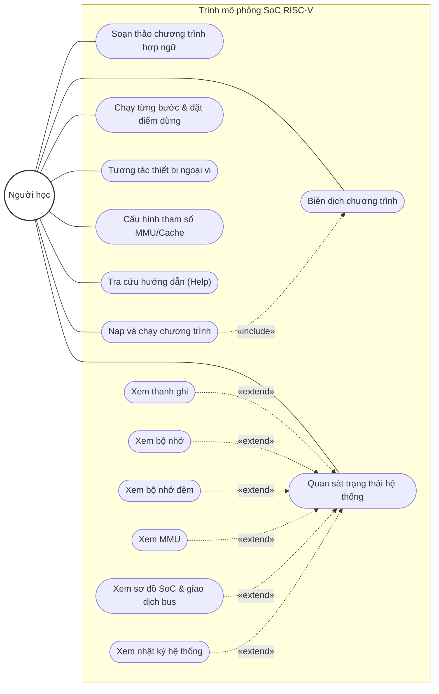
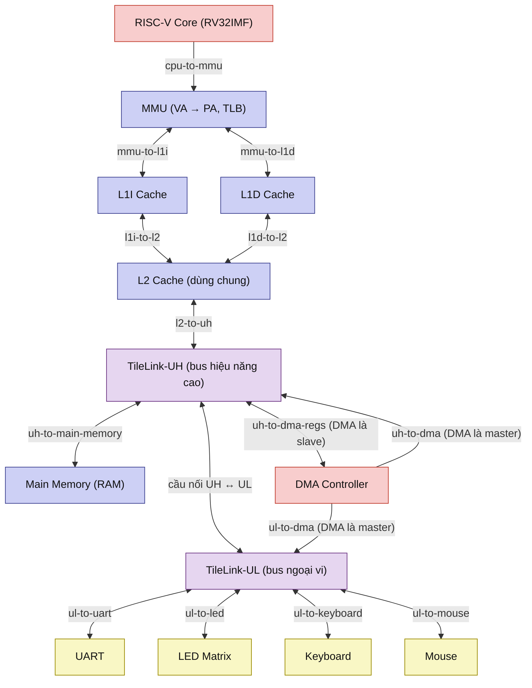
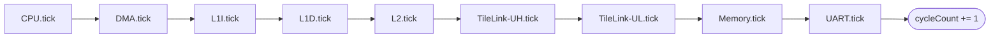
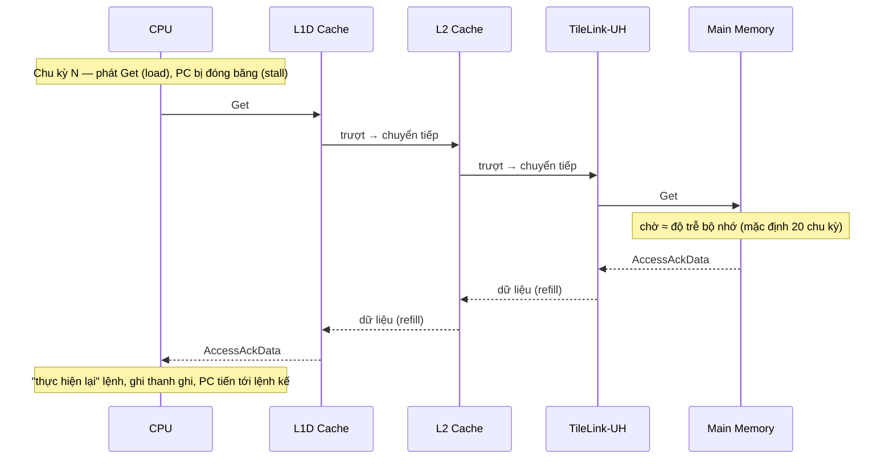
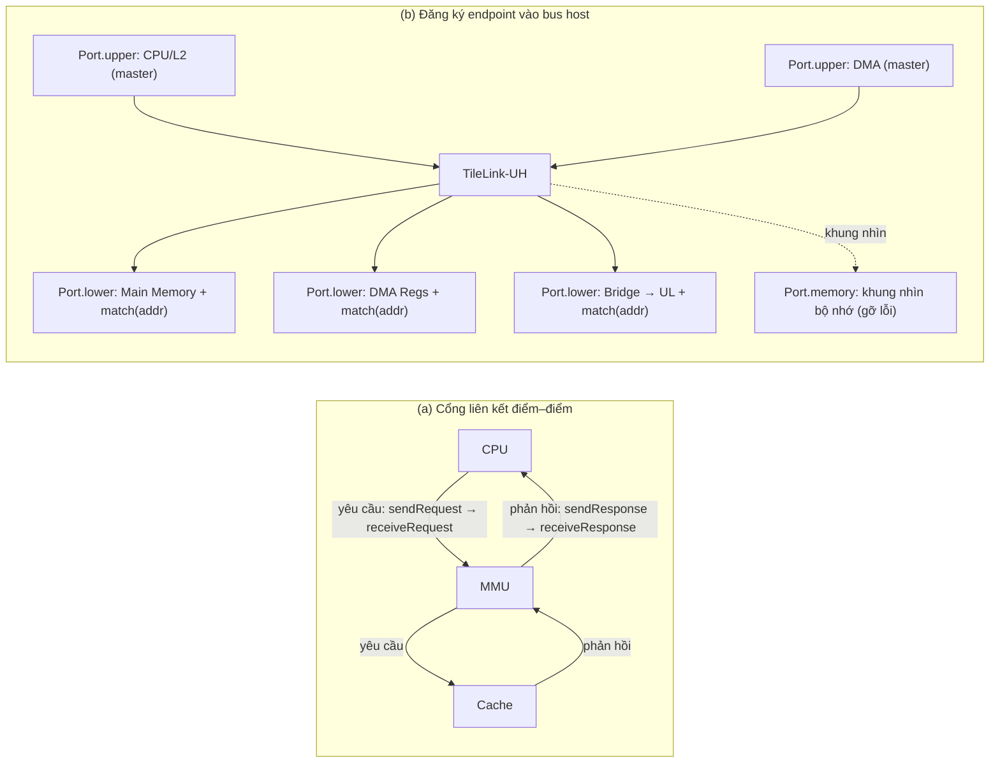
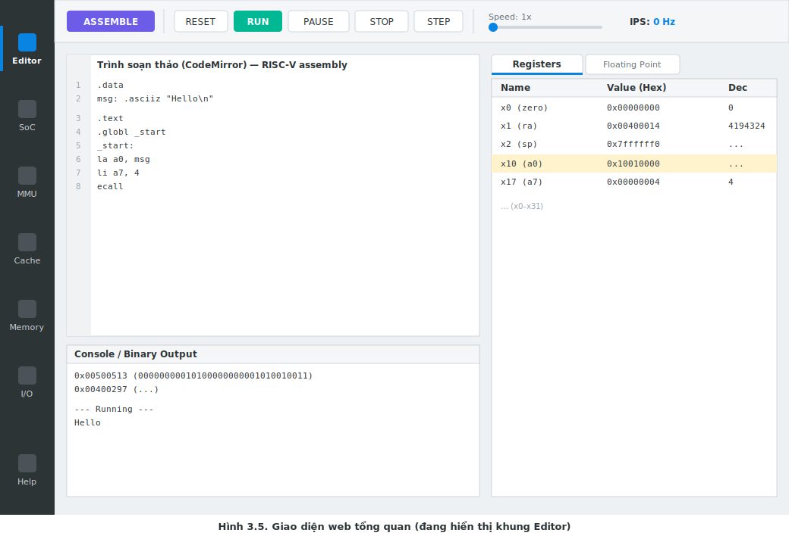
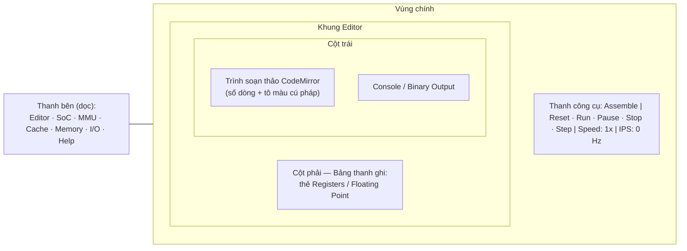
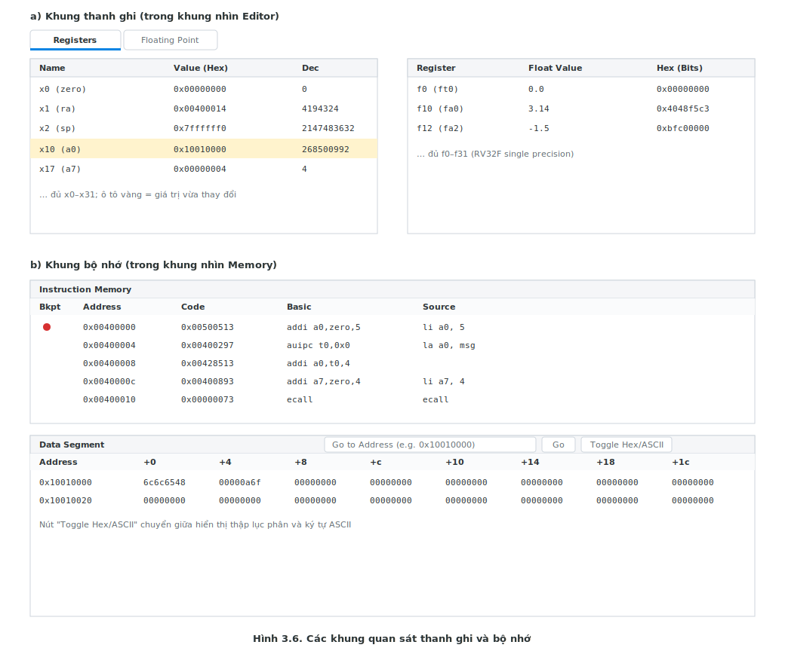
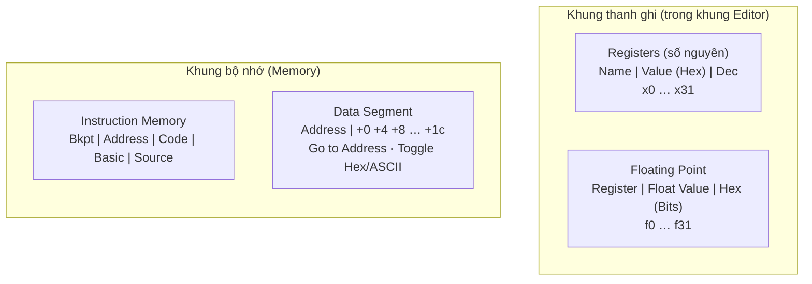
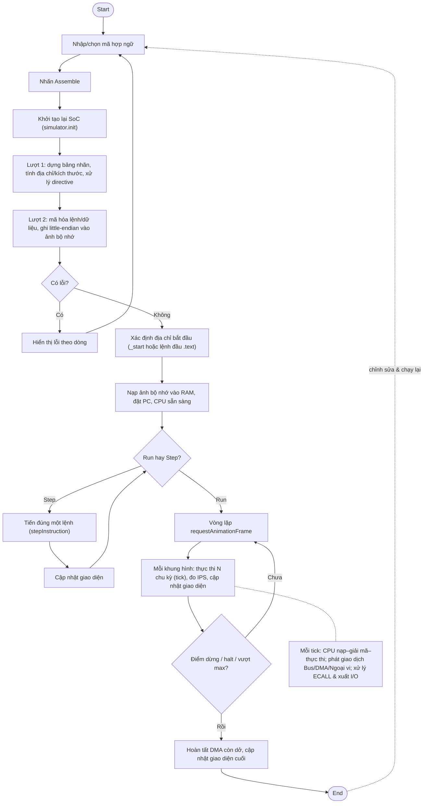

# Hình minh họa Chương 3 (nguồn vẽ)

Tệp này chứa **bản dựng** của 7 hình trong Chương 3, sinh ra từ phần mô tả `[Hình 3.x: …]` trong
[chapter_03.md](../chapters/chapter_03.md). Năm hình sơ đồ (3.1, 3.2, 3.3, 3.4, 3.7) được dựng bằng
**Mermaid** (mã nguồn, sửa và xuất ảnh được); hai hình giao diện (3.5, 3.6) có **wireframe SVG dựng sẵn**
(`fig_3_5_ui_layout.svg`, `fig_3_6_observation_frames.svg`) kèm danh sách nhãn đã đối chiếu với `screenshot.png`,
và có thể thay bằng ảnh chụp màn hình thật khi in báo cáo.

## Cách xem và xuất ảnh

- **Xem nhanh:** mở tệp này trong VS Code (cài tiện ích *Markdown Preview Mermaid Support*) hoặc trên GitHub — các khối ```mermaid``` sẽ tự render.
- **Xuất PNG/SVG để chèn vào Word:** dán từng khối Mermaid vào https://mermaid.live rồi *Export → PNG/SVG*; hoặc lưu khối thành tệp `.mmd` và chạy `npx @mermaid-js/mermaid-cli -i hinh_3_2.mmd -o hinh_3_2.png -s 3` (tùy chọn `-s 3` để tăng độ phân giải).
- **Quy ước màu** (đồng bộ với `docs/ref/SoC.png`): khối chủ động/master = hồng, bộ nhớ & cache = xanh tím, bus TileLink = tím nhạt, ngoại vi MMIO = vàng.

> **Ghi chú trung thực:** nhãn hiển thị của giao diện gọi TileLink-UH là *"coherent bus"*, nhưng hệ thống chỉ hiện thực mức giao dịch kênh A/D (xem mục 2.6.3 và 3.2.1). Trong các hình dưới đây, TileLink-UH được chú là *"bus hiệu năng cao"* để tránh hiểu nhầm về tính nhất quán bộ nhớ đệm.

---

## Hình 3.1 — Sơ đồ use case tổng quát

*Tác nhân chính là Người học; use case "Nạp và chạy" bao hàm «include» "Biên dịch"; use case "Quan sát trạng thái" được mở rộng «extend» bởi các quan sát cụ thể.*



---

## Hình 3.2 — Kiến trúc tổng quan SoC Simulator ⭐

*Chuỗi lõi xử lý → MMU → L1I/L1D → L2 → TileLink-UH → {Main Memory, thanh ghi DMA, cầu nối} → TileLink-UL → {UART, LED, Keyboard, Mouse}; DMA là master trên cả hai bus UH và UL.*



---

## Hình 3.3 — Trình tự tick một chu kỳ và lan truyền yêu cầu

*Phần (a): thứ tự tiến bước cố định trong một chu kỳ. Phần (b): một thao tác nạp dữ liệu lan qua nhiều chu kỳ; PC bị đóng băng trong khi chờ phản hồi.*

**(a) Thứ tự tiến bước trong MỘT chu kỳ `simulator.tick()`** (MMU dịch địa chỉ in-line, không có bước tick riêng):



**(b) Lan truyền một thao tác nạp dữ liệu qua các chu kỳ:**



---

## Hình 3.4 — Mô hình cổng kết nối (Port)

*Bên trái: cổng liên kết điểm–điểm chuyển tiếp yêu cầu xuống và phản hồi lên. Bên phải: cách đăng ký master (upper) và slave (lower, kèm match địa chỉ) vào một bus, cùng cổng memory phục vụ gỡ lỗi.*



---

## Hình 3.5 — Giao diện web tổng quan ⭐ (ảnh chụp có chú thích)

> **Cách dựng hình cuối cùng:** dùng ảnh chụp màn hình thật `screenshot.png` (hoặc chụp lại khung **Editor**), chú thích ba khu vực như sơ đồ khung dưới đây. Lưu ý: `screenshot.png` hiện đang hiển thị khung **SoC**; thanh bên và thanh công cụ giống nhau ở mọi khung, nên có thể dùng trực tiếp; riêng phần nội dung chính nên chụp ở khung Editor để khớp mô tả.

**Nhãn đã đối chiếu với `screenshot.png` (khớp chính xác):**
- Thanh công cụ (trái → phải): `ASSEMBLE` · `RESET` · `RUN` · `PAUSE` · `STOP` · `STEP` · thanh trượt `Speed: 1x` · `IPS: 0 Hz`.
- Thanh bên (trên → dưới): `Editor` · `SoC` · `MMU` · `Cache` · `Memory` · `I/O` · `Help`.
- Tiêu đề thẻ trình duyệt: `RISC-V SoC Simulator`.

**Bản SVG dựng sẵn (mở bằng trình duyệt để xem/ xuất PNG hoặc chèn trực tiếp vào Word):**



**Sơ đồ khung (wireframe) bố cục — phương án Mermaid đơn giản hơn:**



---

## Hình 3.6 — Các khung quan sát thanh ghi và bộ nhớ (ảnh chụp có chú thích)

> **Cách dựng hình cuối cùng:** chụp khung **Editor** (phần bảng thanh ghi) và khung **Memory**, chú thích các cột như dưới đây. Khi một thanh ghi đổi giá trị sau một bước, ô tương ứng được tô sáng — nên chụp ngay sau một lần Step để thấy hiệu ứng này.

**Nhãn cột đã đối chiếu với `src/index.html`:**
- Thanh ghi số nguyên: `Name` | `Value (Hex)` | `Dec` (x0–x31).
- Thanh ghi dấu phẩy động: `Register` | `Float Value` | `Hex (Bits)` (f0–f31).
- Bộ nhớ lệnh: `Bkpt` | `Address` | `Code` | `Basic` | `Source`.
- Vùng dữ liệu: `Address` | `Value (+0)` … `Value (+1c)`; có ô `Go to Address` và nút `Toggle Hex/ASCII`.

**Bản SVG dựng sẵn (mở bằng trình duyệt để xem/ xuất PNG hoặc chèn trực tiếp vào Word):**



**Sơ đồ khung (wireframe) — phương án Mermaid:**



---

## Hình 3.7 — Luồng thực thi chương trình hợp ngữ (đầu–cuối) ⭐

*Sơ đồ hoạt động: nhập mã → assemble (init + 2 lượt) → kiểm tra lỗi → nạp & đặt PC → chọn Run/Step → vòng chạy với điều kiện dừng → cập nhật giao diện; có cung phản hồi về chu trình chỉnh sửa.*



---

## Tình trạng và việc còn lại

| Hình | Dạng | Tình trạng |
|---|---|---|
| 3.1 Use case | Mermaid | Đã dựng — render/xuất ảnh là dùng được |
| 3.2 Kiến trúc tổng quan ⭐ | Mermaid | Đã dựng — đối chiếu khớp `SoC.png` (mở rộng Cache thành L1I/L1D/L2 theo source) |
| 3.3 Trình tự tick | Mermaid (2 phần) | Đã dựng |
| 3.4 Mô hình Port | Mermaid | Đã dựng |
| 3.5 Giao diện tổng quan ⭐ | SVG dựng sẵn + ảnh chụp | Có wireframe `fig_3_5_ui_layout.svg`; nhãn đã đối chiếu `screenshot.png`; bản in cuối có thể thay bằng ảnh chụp khung **Editor** |
| 3.6 Khung quan sát | SVG dựng sẵn + ảnh chụp | Có wireframe `fig_3_6_observation_frames.svg`; nhãn đã đối chiếu `index.html`; bản in cuối có thể thay bằng ảnh chụp khung **Memory** |
| 3.7 Luồng thực thi ⭐ | Mermaid | Đã dựng |

*Lưu ý:* nếu xuất ảnh để in trong báo cáo, nên đặt tên tệp theo số hình (`hinh_3_2.png`, …) và đặt trong thư mục này để dễ tham chiếu từ bản Word/LaTeX cuối cùng.
